# cljs-pdfkit

Clojurescript wrapper around [pdfkit](http://pdfkit.org/) to generate pdfs in the browser or on node.

## Demo

[View Demo](https://cljs-pdfkit.herokuapp.com/index.html)

## Usage
```clojure
(let [document
      (cljs-pdfkit.core/pdf
       [:pdf {:info
               {:title "My Document"
                :author "Me"
                :subject "Important Things"
                :keywords "Wump"
                }
              :layout "landscape"}
        [:page ...]
        [:page ...]])]

  (cond

   save-to-file?
   (.pipe doc (js/fs.createWriteStream "/path/to/file.pdf"))

   write-to-http-response?
   (.pipe doc res)

   write-to-in-browser-blob?
   (.pipe doc (js/blobStream)))

  (.end doc) ;don't forget this one
  )
```

### Setup

Add `[cljs-pdfkit "0.1.0-SNAPSHOT"]` and do `lein npm install`.  cljs-pdfkit can work in the browser, you'll need browserify to collect all the dependencies into a single script

```bash
npm install -g browserify
browserify -r pdfkit -r brfs -r blob-stream -o bundle.js
```

Insert bundle.js before your clojurescript elements.  This enables cljs-pdfkit to require pdfkit as necessary.

```html
<script src="/bundle.js"></script>
```

### Development

```bash
git clone https://github.com/whamtet/cljs-pdfkit
cd cljs-pdfkit
lein npm install
lein build
```

This sets a watch script that will recompile on source code changes.

### Creating a Page

```clojure
[:page {:top 50
        :bottom 50
        :left 72
        :right 72}
 ...]
```

### Fill and Stroke Styles

```clojure
:line-width :line-cap :line-join :miter-limit :dash
:fill-color :stroke-color :opacity :fill-opacity :stroke-opacity
```

### Style Elements

Applies a style to all children

```clojure
[:style style
 ...]
```

Style maps are optional second arguments and can be included in all elements.

### Lines and Curves

```clojure
[:line style x1 y1 x2 y2]
[:quadratic-curve style x1 y2 x2 y2 x3 y3]
[:bezier-curve style x1 y1 x2 y2 x3 y3 x4 y4]
```

### SVG Paths

```clojure
[:path style "M 0,20 L 100,160 Q 130,200 150,120 C 190,-40 200,200 300,150 L 400,90"]
```

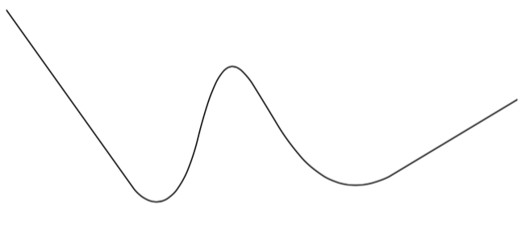

### Shapes

```clojure
[:rect style x y width height]
[:rounded-rect style x y with height corner-radius]
[:ellipse style x y radius-x radius-y]
[:circle style centre-x centre-y radius]
[:polygon style [x1 y1] [x2 y2] ...]
```

For example

```clojure
[:style {:line-width 25}
 [:line {:line-cap "butt"} 50 20 100 20]
 [:line {:line-cap "round"} 150 20 200 20]
 [:circle {:line-cap "square"} 275 30 15]
 [:rect {:line-join "miter"} 50 100 50 50]
 [:rect {:line-join "round"} 150 100 50 50]
 [:rect {:line-join "bevel"} 250 100 50 50]]
```

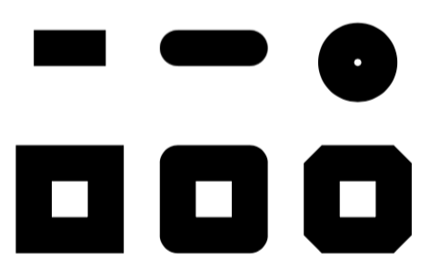

### Dashed Lines

```clojure
[:circle {:dash [5 {:space 10}]} 100 50 50]
```

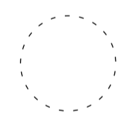

### Color

Use `fill-and-stroke` to set both at the same time

```clojure
[:circle {:line-width 3 :fill-opacity 0.8 :fill-and-stroke ["red" "#900"]} 100 50 50]
```

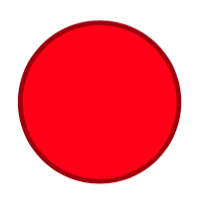

### Gradients

Both linear and radial gradients are supported.

```clojure
[:style {:translate [50 50]}
 [:rect {:linear-gradient {:points [50 0 150 100] :stops [[0 "green"] [1 "red"]]}}
  50 0 100 100]
 [:circle {:radial-gradient {:points [300 50 0 300 50 50] :stops [[0 "orange" 0] [1 "orange" 1]]}}
  300 50 50]]
```

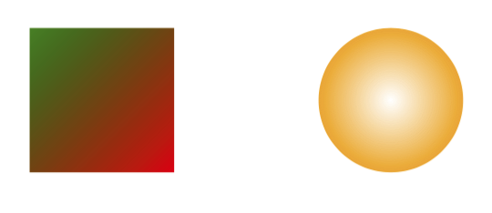

### Winding Rules

`:fill` and `:fill-and-stroke` can be set to either `"non-zero"` or `"even-odd"`.

```clojure
[:style {:fill-color "red" :translate [-100 -50]}
 [:style {:scale 0.8}
  [:path {:fill "non-zero"}
   "M 250,75 L 323,301 131,161 369,161 177,301 z"]
  [:path {:translate [280 0] :fill "even-odd"}
   "M 250,75 L 323,301 131,161 369,161 177,301 z"]]]
```


The above shows how to control the order of transformations `:translate` and `:scale` by nesting them with style blocks.

### Clipping

```clojure
[:clip {} clipping-polygon children-to-be-clipped]
```

`:clip` takes a clipping polygon that masks over child elements

```clojure
[:clip {} [:circle 100 100 100] ;clipping polygon
 (for [row (range 10) col (range 10)]
   [:rect {:fill (if (zero? (- (mod row 2) (mod col 2))) "#eee" "#4183C4")}
    (* row 20) (* col 20) 20 20])]
```


### Text Alignment

```clojure
(def lorem
  "Lorem ipsum dolor sit amet, consectetur adipiscing elit. Etiam in suscipit
  purus. Vestibulum ante ipsum primis in faucibus orci luctus et ultrices posuere
  cubilia Curae; Vivamus nec hendrerit felis. Morbi aliquam facilisis risus eu lacinia.
  Sed eu leo in turpis fringilla hendrerit. Ut nec accumsan nisl.")

(def alignments ["left" "center" "right" "justify"])
(def lorem-prefixes ["This text is left aligned. "
                     "This text is centered. "
                     "This text is right aligned. "
                     "This text is justified. "])

(map
 (fn [alignment prefix]
   [:text {:font-size 8 :width 410 :align alignment :move-down true} (str prefix lorem)])
 alignments
 lorem-prefixes)
```

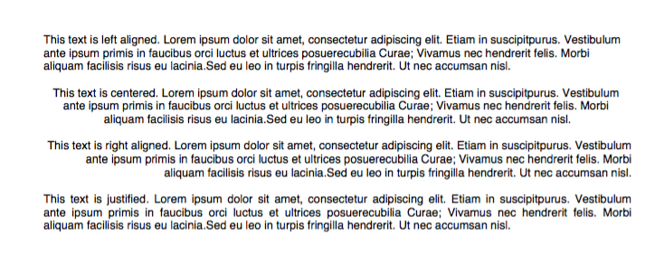

### Text Styles

```clojure
:line-break :width :height :ellipsis :columns :column-gap :indent :paragraph-gap :word-spacing
:character-spacing :link :underline :strike :align :fill :fill-and-stroke :linear-gradient :radial-gradient
```

Here is an example that wraps a paragraph into three columns

```clojure
(let [
      lorem "Lorem ipsum dolor sit amet, consectetur adipiscing elit. Etiam in suscipit
      purus. Vestibulum ante ipsum primis in faucibus orci luctus et ultrices posuere
      cubilia Curae; Vivamus nec hendrerit felis. Morbi aliquam facilisis risus eu lacinia.
      Sed eu leo in turpis fringilla hendrerit. Ut nec accumsan nisl. Suspendisse rhoncus
      nisl posuere tortor tempus et dapibus elit porta. Cras leo neque, elementum a rhoncus
      ut, vestibulum non nibh. Phasellus pretium justo turpis. Etiam vulputate, odio vitae
      tincidunt ultricies, eros odio dapibus nisi, ut tincidunt lacus arcu eu elit. Aenean
      velit erat, vehicula eget lacinia ut, dignissim non tellus. Aliquam nec lacus mi, sed
      vestibulum nunc. Suspendisse potenti. Curabitur vitae sem turpis. Vestibulum sed
      neque eget dolor dapibus porttitor at sit amet sem. Fusce a turpis lorem. Vestibulum
      ante ipsum primis in faucibus orci luctus et ultrices posuere cubilia Curae;"

      lorem (apply str (map #(.trim %) (.split lorem "\n")))

      ]
  [:page
   [:text {:columns 3 :column-gap 15 :height 100 :width 465 :align "justify" :font-size 8}
    lorem]])
```

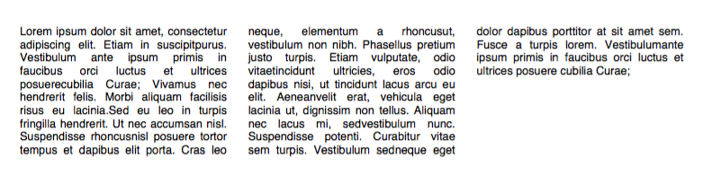

You can also merge different styles into the same paragraph with the `:continued` keyword.

```clojure
[:page
 [:text {:fill-color "green" :width 465 :continued true}
  (.substring lorem 0 500)]
 [:text {:fill-color "red" :width 465}
  (.substring lorem 500)]]
```

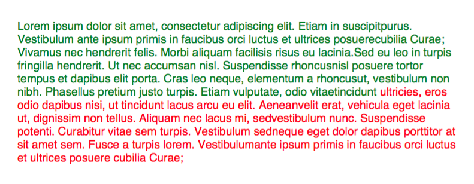

### Links

Add links to text as follows.  Use the `:continued` keyword if you wish to append non-link text

```clojure
[:style {:font-size 20}
 [:text {:fill-color "blue"
         :link "http://www.example.com"
         :underline true
         :continued true
         }
  "My Link"]
 [:text {:underline false} " Click it please!"]]

```

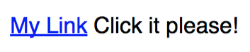

### Fonts

PDF supports 14 default fonts.  Additional fonts may be loaded from an external resource folder.

```clojure
[:style {:font-size 18}
 [:text {:move-down 0.5 :font "Times-Roman"} "Hello from Times Roman"]
 [:text {:move-down 0.5 :font "fonts/GoodDog.ttf"} "This is Good Dog!"]
 [:text {:move-down 0.5 :font ["fonts/Chalkboard.ttc" "Chalkboard-Bold"]} "Chalkboard"]]
```

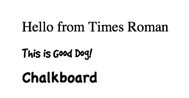

### Images

Images support **width** **height** **scale** and **fit** parameters.
If a single one of **width** or **height** or provided, the other dimension is scaled to preserve aspect ratio.
The `:fit [width height]` parameter fits the image within a box of **width** and **height**.

```clojure
[:page
 [:image "images/test.jpeg" 0 15 {:width 300}]
 [:text "Proprotional to width" 0 0]
 [:image "images/test.jpeg" 320 15 {:fit [100 100]}]
 [:rect 320 15 100 100]
 [:text "Fit" 320 0]
 [:image "images/test.jpeg" 320 145 {:width 200 :height 100}]
 [:text "Stretch" 320 130]
 [:image "images/test.jpeg" 320 280 {:scale 0.25}]
 ]
```

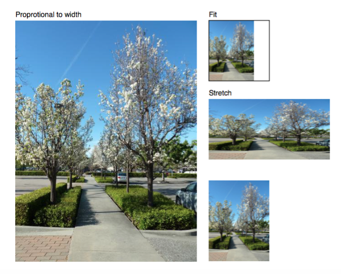

### Annotations

```clojure
[:node x y width height contents options]
[:link x y width height url options]
[:highlight x y width height options]
[:underline x y width height options]
[:strike x y width height options]
[:line-annotation x1 y1 x2 y2 options]
[:rect-annotation x y width height options]
[:ellipse-annotation x y width height options]
[:text-annotation x y width height text options]
```
## License

Copyright © 2015 Matthew Molloy

Distributed under the Eclipse Public License either version 1.0 or (at your option) any later version.
